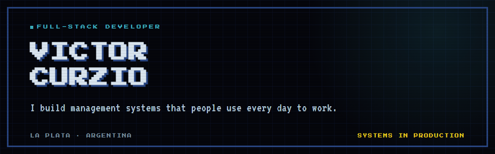
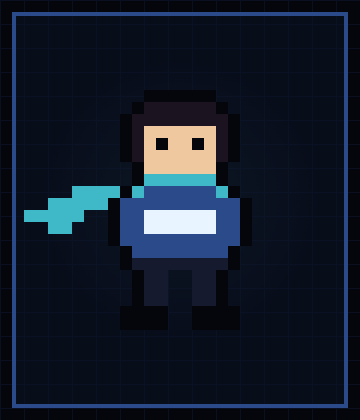

[Portfolio](https://viccurzio.github.io/portfolio/) · [LinkedIn](https://www.linkedin.com/in/victor-roberto-curzio/) · [victor.curzio@hotmail.com](mailto:victor.curzio@hotmail.com)

## About me

- I build **management systems**: the kind where a consistency bug costs real money, not a bad layout.
- What interests me is not the tools, it is the **trade-offs**. Why this architecture and not another one. What breaks when the system doubles in size. Which technical debt is worth taking on today and which one mortgages next year.
- Technical reference for a five-person team at **Grupo DELSUD**, and technical lead of a B2B platform as a freelancer.
- Studying **Licenciatura en Sistemas** at Universidad Nacional de La Plata, alongside a full-time job, for the groundwork the day-to-day does not give: algorithms, concurrency, operating systems and databases.
- Based in **La Plata, Argentina**. I work remotely.

 

## Where my code runs

**Grupo DELSUD** — technical reference for a five-person team.

I designed a plot-sales management system from scratch (Node, TypeScript, Drizzle; twenty modules covering contracts, collections, cash flow and inflation indexing) and integrated it with the CRM already running in production: two databases, two ORMs, bidirectional sync, no downtime. Fifteen people operate it today, over more than 200 contracts.

Now I work on the group's internal ERP — ten repositories, one microservice per department. I built the workday time-tracking module end to end, on an immutable append-only log that nobody can edit after the fact. Twenty people across three departments use it.

**2winGs International Group LLC** — technical lead, freelance.

A B2B creative-talent platform. The architecture decisions are mine: NestJS on Fastify, PostgreSQL with Drizzle, Redis queues with BullMQ, a React front on Cloudflare Pages, the API on a dedicated server under PM2 behind nginx. Deployment runs on GitHub Actions: it builds off the server, applies the migrations, and only then restarts. The database is dumped daily to a provider other than the one hosting the server, and restored against a throwaway database — a backup nobody restored is not a backup.

Both are private repositories. What follows is public.

## Selected work

### [vault-rag](https://github.com/VicCurzio/vault-rag)

Meaning-based search and a question-answering agent over a folder of markdown notes. 340 notes, 5,338 chunks, embeddings computed locally.

**The interesting part:** the automated evaluation deliberately includes questions whose answer is *not* in the notes. A green run that was never given anything to reject does not prove the guard is switched on. It sits at 89% recall and 100% rejection over 34 questions.

### [cv-match](https://github.com/VicCurzio/cv-match)

A tool to build and adapt a CV to the market it is going to, and to whether a person or an automated filter will read it.

**The interesting part:** it has no server and no database on purpose. A CV carries personal data and has no reason to leave the machine, so everything runs in the browser. The PDF is generated as real text instead of an image, so a filter can actually read it. Over 300 tests on the domain.

### [musik](https://github.com/VicCurzio/musik)

Installable player that reads the music already on the device. No account, no server, no ads, and no file ever leaves the phone.

**The interesting part:** volume is evened out by measuring each track on import and only ever attenuating, because amplifying a quiet track digitally distorts it. Tag reading runs on a separate thread so importing hundreds of files does not freeze the interface.

### [portfolio](https://github.com/VicCurzio/portfolio)

My own site, in Spanish and English, with an 8-bit console look.

**The interesting part:** the same content file that renders the site also generates eleven CVs as PDFs, one per kind of role. A change to my experience is never copied by hand into a document.

### [plagas-out](https://github.com/VicCurzio/plagas-out)

Landing page for a pest control service.

**The interesting part:** the contact form sends real email with no backend of its own, and falls back to the visitor's mail client if the send fails, so a query is never silently lost.

### [bot_whatsapp](https://github.com/VicCurzio/bot_whatsapp)

Python. Bulk WhatsApp messages from a spreadsheet, with a graphical interface and a command-line mode.

## Stack

